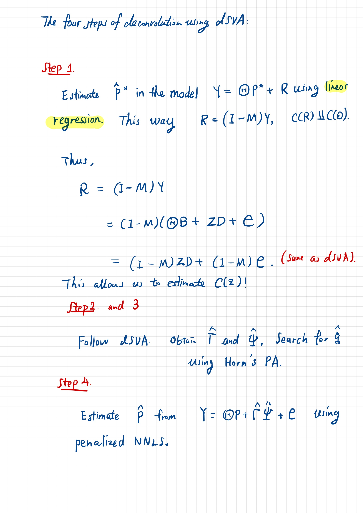

```{r setup, include=FALSE}
knitr::opts_chunk$set(echo = TRUE, eval = TRUE, warning = FALSE, message = FALSE, fig.align = 'center')
options(scipen = 1, digits = 3)
```

```{r packages, echo=TRUE}
source("a02_dSVA_functional.R")
source("s02_simulation_functions.R")
library(extraDistr)
library(statmod)
library(MASS)
library(dplyr)
library(tidyr)
library(statmod)
library(PCAtools)
library(paran)
library(sva)
library(DescTools)
library(microbenchmark)
set.seed(100)
```

## Model

Assume the deconvolution model under the influence of latent factors is generated from the following model

$$
\mathbf{Y}_{m \times n} = \mathbf{\Theta}_{m \times K} \mathbf{P}_{K \times n} + \mathbf{Z}_{m \times p}\mathbf{D}_{p \times n} + \mathbf{E}_{m \times n}
$$
where $\mathbf{D}_{p \times n} $ and $\mathbf{Z}_{m \times p}$ are unknown latent factors, $E\left[ \mathbf{E}_{m \times n} \right] = 0$. 

Notations for dimensions are as follows:

  * $n$: number of samples;
  * $m$: number of genes ($m >> n$);
  * $K$: number of cell types;
  * $p$: number of hidden factors.
  
## Estimating The Components

## dSVA Algorithm

To properly run the dSVA algorithm, we need to figure out what regression is needed in each step. The 



## Simulations

We aim at finding a simulation parameter setting where latent variables can carry significant variations as compared to that carried by the regression parameters, such that using dSVA can prove to be beneficial.

Then, we run the SVA analysis to find whether the current simulated latent variable variation can be re-captured effectively.

$$
\mathbf{Y}_{m \times n} = \mathbf{\Theta}_{m \times K} \mathbf{P}_{K \times n} + \mathbf{Z}_{m \times p}\mathbf{D}_{p \times n} + \mathbf{E}_{m \times n}, \\
\mathbf{P}_{K \times n} \geq 0, \\
\mathbf{P}_{K \times n}^T \mathbf{1}_K = \mathbf{1}_n.
$$
  
  
  * $\lambda$: controls the gene expression cell-type specificity;
  * $\gamma$: controls the elevated effects of the latent variable on marker genes. 

### Case 1: random direction of latent variable

Create an error-free model $\mathbf{E} = \mathbf{0}$ first:

  * $\mathbf{x}_j^T \sim \chi^2_{200} * \pi(W \cdot {\rm dir}(1, 1, \dots, 1) + (1 - W) \cdot {\rm dir}(\lambda, 1, \dots, 1) )$, $W \sim Ber(p_{\rm sig})$, and $\pi$ is a sampling operator;
  * $\mathbf{p}_i \sim {\rm dir}(\alpha_{i1}, \dots, \alpha_{iK})$;
  * $\mathbf{d}^T_1 = (0, \dots. 0, 1, \dots, 1)^T$ ($n/2$ $0$s and $1$s each).
  * $z_{1j} \sim W * \chi^2_{\gamma \cdot 200} + (1 - W) * \chi^2_{200}$.

```{}
  D[1, ] <- c(rep(0, floor(n/2)), rep(1, ceiling(n/2)))
  Z[, 1] <- W * rchisq(n = m, df = gamma * 200) + (1 - W) * rchisq(n = m, df = 200)
```

Here, we model the situation where being in the latent group 1 (dummy variable value = 1) increases the expression of a gene to on average 2 times as high. If the gene is a marker genes, the expression is increased to $\gamma + 1$ times as high.

```{r sim_param}
n <- 20
m <- 1000
K <- 5
p <- 1
p_sig <- 0.5
lambda <- 5
gamma_seq <- 1:3
```

#### If $q$ is known:

In the first set of simulation, we assume that we know $q$ perfectly.

```{r simulation_code_case_1_q_known, echo = FALSE, message = FALSE, warning = FALSE}
B <- 100 # run the simulation B times
par(mfrow = c(1, 3))
result_matrix <- matrix(nrow = B, ncol = 12)
for (gamma in gamma_seq) {
  for (b in 1:B) {
    # gamma = 2
    # b = 1
    true_data <- dSVA_model_sim_intercept(m, n, K, p, p_sig, lambda, gamma)
    
    ## dSVA
    P_dsva <- dsva_ext_know_q(Y = true_data$Y, X = true_data$X)$P_hat
  
    ## NNLS
    P_nnls <- apply(true_data$Y, 2, function(y) {lsei::nnls(a = true_data$X, b = y)$x})
    P_nnls <- apply(P_nnls, 2, function(x) x/sum(x))
    
    ## constrained NNLS
    P_pnnls <- apply(true_data$Y, 2, function(y) {lsei::pnnls(a = true_data$X, b = y, sum = 1)$x})
    
    ## if we know both X and Z
    P_hat <- apply(true_data$Y - true_data$Z %*% true_data$D, 2, function(y) {lsei::pnnls(a = true_data$X, b = y , sum = 1)$x})
    
    ## mean sample-wise correlations
    cor_dsva <- mean(my_cor(true_data$P_star, P_dsva))
    cor_nnls <- mean(my_cor(true_data$P_star, P_nnls))
    cor_pnnls <- mean(my_cor(true_data$P_star, P_pnnls))
    cor_best <- mean(my_cor(true_data$P_star, P_hat))
    
    ## mean CCC
    ccc_dsva <- mean(my_ccc(true_data$P_star, P_dsva))
    ccc_nnls <- mean(my_ccc(true_data$P_star, P_nnls))
    ccc_pnnls <- mean(my_ccc(true_data$P_star, P_pnnls))
    ccc_best <- mean(my_ccc(true_data$P_star, P_hat))
    
    ## mean squared errors
    mse_dsva <- my_mse(true_data$P_star, P_dsva)
    mse_nnls <- my_mse(true_data$P_star, P_nnls)
    mse_pnnls <- my_mse(true_data$P_star, P_pnnls)
    mse_best <- my_mse(true_data$P_star, P_hat)
    
    result_matrix[b, ] <- c(cor_dsva, cor_nnls, cor_pnnls, cor_best, 
                            ccc_dsva, ccc_nnls, ccc_pnnls, ccc_best,
                            mse_dsva, mse_nnls, mse_pnnls, mse_best)
  }
  result_df <- as_tibble(cbind(1:B, result_matrix))
  colnames(result_df) <- c("b", 
                           "cor_dsva", "cor_nnls", "cor_pnnls", "cor_known",
                           "ccc_dsva", "ccc_nnls", "ccc_pnnls", "ccc_known", 
                           "mse_dsva", "mse_nnls", "mse_pnnls", "mse_known")
  boxplot(result_df$cor_dsva, result_df$cor_nnls, result_df$cor_pnnls, result_df$cor_known, 
          main = paste0("gamma = ", gamma), xlab = "Method", ylab = "Pearson's Correlation",
          col = c("violet", "orange", "azure", "lightpink"))
  axis(1, at = c("1", "2", "3", "4"), labels = c("dSVA", "NNLS", "PNNLS", "Known"))
  boxplot(result_df$ccc_dsva, result_df$ccc_nnls, result_df$ccc_pnnls, result_df$ccc_known, 
          main = paste0("gamma = ", gamma), xlab = "Method", ylab = "CCC",
          col = c("violet", "orange", "azure", "lightpink"))
  axis(1, at = c("1", "2", "3", "4"), labels = c("dSVA", "NNLS", "PNNLS", "Known"))
  boxplot(result_df$mse_dsva, result_df$mse_nnls, result_df$mse_pnnls, result_df$mse_known, 
          main = paste0("gamma = ", gamma), xlab = "Method", ylab = "MSE",
          col = c("violet", "orange", "azure", "lightpink"))
  axis(1, at = c("1", "2", "3", "4"), labels = c("dSVA", "NNLS", "PNNLS", "Known"))
  # hist(q_hats, 
  #      # main = "Estimated Number of Latent Factors by Horn's PA",
  #      xlab = "Estimated q")
}
```

#### If $q$ is unknown:

If the $q$ is unknown, we need to estimate the value of $q$, which could be accomplished by using Horn's parallel analysis (PA). This takes a few minutes to run.

```{r simulation_code_case_1_q_unknown, echo = FALSE, message = FALSE, warning = FALSE}
## Assume that q is unknown
B <- 100 # run the simulation B times
par(mfrow = c(2, 2))
result_matrix <- matrix(nrow = B, ncol = 12)
q_hats <- vector(mode = "double", length = B)

for (gamma in gamma_seq) {
  for (b in 1:B) {
    true_data <- dSVA_model_sim_intercept(m, n, K, p, p_sig, lambda, gamma)
    
    ## dSVA
    dsva_ls <- dsva_ext(Y = true_data$Y, 
                        X = true_data$X, 
                        quietly = TRUE, 
                        status = FALSE)
    P_dsva <- dsva_ls$P_hat
    q_hats[b] <- dsva_ls$q_hat
  
    ## NNLS
    P_nnls <- apply(true_data$Y, 2, function(y) {lsei::nnls(a = true_data$X, b = y)$x})
    P_nnls <- apply(P_nnls, 2, function(x) x/sum(x))
    
    ## constrained NNLS
    P_pnnls <- apply(true_data$Y, 2, function(y) {lsei::pnnls(a = true_data$X, b = y, sum = 1)$x})
    
    ## if we know both X and Z
    P_hat <- apply(true_data$Y - true_data$Z %*% true_data$D, 2, function(y) {lsei::pnnls(a = true_data$X, b = y , sum = 1)$x})
    
    ## mean sample-wise correlations
    cor_dsva <- mean(my_cor(true_data$P_star, P_dsva))
    cor_nnls <- mean(my_cor(true_data$P_star, P_nnls))
    cor_pnnls <- mean(my_cor(true_data$P_star, P_pnnls))
    cor_best <- mean(my_cor(true_data$P_star, P_hat))
    
    ## mean CCC
    ccc_dsva <- mean(my_ccc(true_data$P_star, P_dsva))
    ccc_nnls <- mean(my_ccc(true_data$P_star, P_nnls))
    ccc_pnnls <- mean(my_ccc(true_data$P_star, P_pnnls))
    ccc_best <- mean(my_ccc(true_data$P_star, P_hat))
    
    ## mean squared errors
    mse_dsva <- my_mse(true_data$P_star, P_dsva)
    mse_nnls <- my_mse(true_data$P_star, P_nnls)
    mse_pnnls <- my_mse(true_data$P_star, P_pnnls)
    mse_best <- my_mse(true_data$P_star, P_hat)
    
    result_matrix[b, ] <- c(cor_dsva, cor_nnls, cor_pnnls, cor_best, 
                            ccc_dsva, ccc_nnls, ccc_pnnls, ccc_best,
                            mse_dsva, mse_nnls, mse_pnnls, mse_best)
  }
  result_df <- as_tibble(cbind(1:B, result_matrix))
  colnames(result_df) <- c("b", 
                           "cor_dsva", "cor_nnls", "cor_pnnls", "cor_known",
                           "ccc_dsva", "ccc_nnls", "ccc_pnnls", "ccc_known", 
                           "mse_dsva", "mse_nnls", "mse_pnnls", "mse_known")
  boxplot(result_df$cor_dsva, result_df$cor_nnls, result_df$cor_pnnls, result_df$cor_known, 
          main = paste0("gamma = ", gamma), xlab = "Method", ylab = "Pearson's Correlation",
          col = c("violet", "orange", "azure", "lightpink"))
  axis(1, at = c("1", "2", "3", "4"), labels = c("dSVA", "NNLS", "PNNLS", "Known"))
  boxplot(result_df$ccc_dsva, result_df$ccc_nnls, result_df$ccc_pnnls, result_df$ccc_known, 
          main = paste0("gamma = ", gamma), xlab = "Method", ylab = "CCC",
          col = c("violet", "orange", "azure", "lightpink"))
  axis(1, at = c("1", "2", "3", "4"), labels = c("dSVA", "NNLS", "PNNLS", "Known"))
  boxplot(result_df$mse_dsva, result_df$mse_nnls, result_df$mse_pnnls, result_df$mse_known, 
          main = paste0("gamma = ", gamma), xlab = "Method", ylab = "MSE",
          col = c("violet", "orange", "azure", "lightpink"))
  axis(1, at = c("1", "2", "3", "4"), labels = c("dSVA", "NNLS", "PNNLS", "Known"))
  hist(q_hats,
       # main = "Estimated Number of Latent Factors by Horn's PA",
       xlab = "Estimated q")
}  
```

This shows that even though the number of factors $q$ in each simulation is grossly overestimated, the resultant dSVA results are still an improvement from the rest.

### Case 2: latent variable strengthens the expression of one cell type

Let us assume that the latent variables increases the cell-type specific expression of Cell Type 1 to $\gamma$ times as high.

  * $\mathbf{z}_1 = \gamma * \mathbf{\theta}^*_1$.
  
``` {}
  Z[, 1] <- W * rchisq(n = m, df = gamma * 200) + (1 - W) * rchisq(n = m, df = 200)
```

#### When $q$ is known

```{r simulation_code_case_2_q_known, echo = FALSE, message = FALSE, warning = FALSE}
B <- 100 # run the simulation B times
par(mfrow = c(1, 3))
result_matrix <- matrix(nrow = B, ncol = 12)

for (gamma in gamma_seq) {
  for (b in 1:B) {
    true_data <- dSVA_model_sim_ct_strengthen(m, n, K, p, p_sig, lambda, gamma)
    
    ## dSVA
    dsva_ls <- dsva_ext_know_q(Y = true_data$Y, X = true_data$X)
    P_dsva <- dsva_ls$P_hat
    
    ## NNLS
    P_nnls <- apply(true_data$Y, 2, function(y) {lsei::nnls(a = true_data$X, b = y)$x})
    P_nnls <- apply(P_nnls, 2, function(x) x/sum(x))
    
    ## constrained NNLS
    P_pnnls <- apply(true_data$Y, 2, function(y) {lsei::pnnls(a = true_data$X, b = y, sum = 1)$x})
    
    ## if we know both X and Z
    P_hat <- apply(true_data$Y - true_data$Z %*% true_data$D, 2, function(y) {lsei::pnnls(a = true_data$X, b = y , sum = 1)$x})
    
    ## mean sample-wise correlations
    cor_dsva <- mean(my_cor(true_data$P_star, P_dsva))
    cor_nnls <- mean(my_cor(true_data$P_star, P_nnls))
    cor_pnnls <- mean(my_cor(true_data$P_star, P_pnnls))
    cor_best <- mean(my_cor(true_data$P_star, P_hat))
    
    ## mean CCC
    ccc_dsva <- mean(my_ccc(true_data$P_star, P_dsva))
    ccc_nnls <- mean(my_ccc(true_data$P_star, P_nnls))
    ccc_pnnls <- mean(my_ccc(true_data$P_star, P_pnnls))
    ccc_best <- mean(my_ccc(true_data$P_star, P_hat))
    
    ## mean squared errors
    mse_dsva <- my_mse(true_data$P_star, P_dsva)
    mse_nnls <- my_mse(true_data$P_star, P_nnls)
    mse_pnnls <- my_mse(true_data$P_star, P_pnnls)
    mse_best <- my_mse(true_data$P_star, P_hat)
    
    result_matrix[b, ] <- c(cor_dsva, cor_nnls, cor_pnnls, cor_best, 
                            ccc_dsva, ccc_nnls, ccc_pnnls, ccc_best,
                            mse_dsva, mse_nnls, mse_pnnls, mse_best)
  }
  result_df <- as_tibble(cbind(1:B, result_matrix))
  colnames(result_df) <- c("b", 
                           "cor_dsva", "cor_nnls", "cor_pnnls", "cor_known",
                           "ccc_dsva", "ccc_nnls", "ccc_pnnls", "ccc_known", 
                           "mse_dsva", "mse_nnls", "mse_pnnls", "mse_known")
  boxplot(result_df$cor_dsva, result_df$cor_nnls, result_df$cor_pnnls, result_df$cor_known, 
          main = paste0("gamma = ", gamma), xlab = "Method", ylab = "Pearson's Correlation",
          col = c("violet", "orange", "azure", "lightpink"))
  axis(1, at = c("1", "2", "3", "4"), labels = c("dSVA", "NNLS", "PNNLS", "Known"))
  boxplot(result_df$ccc_dsva, result_df$ccc_nnls, result_df$ccc_pnnls, result_df$ccc_known, 
          main = paste0("gamma = ", gamma), xlab = "Method", ylab = "CCC",
          col = c("violet", "orange", "azure", "lightpink"))
  axis(1, at = c("1", "2", "3", "4"), labels = c("dSVA", "NNLS", "PNNLS", "Known"))
  boxplot(result_df$mse_dsva, result_df$mse_nnls, result_df$mse_pnnls, result_df$mse_known, 
          main = paste0("gamma = ", gamma), xlab = "Method", ylab = "MSE",
          col = c("violet", "orange", "azure", "lightpink"))
  axis(1, at = c("1", "2", "3", "4"), labels = c("dSVA", "NNLS", "PNNLS", "Known"))
  # hist(q_hats, 
  #      # main = "Estimated Number of Latent Factors by Horn's PA",
  #      xlab = "Estimated q")
}
```

#### When $q$ is unknown:
```{r simulation_code_case_2_q_unknown, echo = FALSE, message = FALSE, warning = FALSE}
## Assume that q is unknown
B <- 100 # run the simulation B times
par(mfrow = c(2, 2))
result_matrix <- matrix(nrow = B, ncol = 12)
q_hats <- vector(mode = "double", length = B)

for (gamma in gamma_seq) {
  for (b in 1:B) {
    true_data <- dSVA_model_sim_ct_strengthen(m, n, K, p, p_sig, lambda, gamma)
    
    ## dSVA
    dsva_ls <- dsva_ext(Y = true_data$Y, 
                        X = true_data$X, 
                        quietly = TRUE, 
                        status = FALSE)
    P_dsva <- dsva_ls$P_hat
    q_hats[b] <- dsva_ls$q_hat
  
    ## NNLS
    P_nnls <- apply(true_data$Y, 2, function(y) {lsei::nnls(a = true_data$X, b = y)$x})
    P_nnls <- apply(P_nnls, 2, function(x) x/sum(x))
    
    ## constrained NNLS
    P_pnnls <- apply(true_data$Y, 2, function(y) {lsei::pnnls(a = true_data$X, b = y, sum = 1)$x})
    
    ## if we know both X and Z
    P_hat <- apply(true_data$Y - true_data$Z %*% true_data$D, 2, function(y) {lsei::pnnls(a = true_data$X, b = y , sum = 1)$x})
    
    ## mean sample-wise correlations
    cor_dsva <- mean(my_cor(true_data$P_star, P_dsva))
    cor_nnls <- mean(my_cor(true_data$P_star, P_nnls))
    cor_pnnls <- mean(my_cor(true_data$P_star, P_pnnls))
    cor_best <- mean(my_cor(true_data$P_star, P_hat))
    
    ## mean CCC
    ccc_dsva <- mean(my_ccc(true_data$P_star, P_dsva))
    ccc_nnls <- mean(my_ccc(true_data$P_star, P_nnls))
    ccc_pnnls <- mean(my_ccc(true_data$P_star, P_pnnls))
    ccc_best <- mean(my_ccc(true_data$P_star, P_hat))
    
    ## mean squared errors
    mse_dsva <- my_mse(true_data$P_star, P_dsva)
    mse_nnls <- my_mse(true_data$P_star, P_nnls)
    mse_pnnls <- my_mse(true_data$P_star, P_pnnls)
    mse_best <- my_mse(true_data$P_star, P_hat)
    
    result_matrix[b, ] <- c(cor_dsva, cor_nnls, cor_pnnls, cor_best, 
                            ccc_dsva, ccc_nnls, ccc_pnnls, ccc_best,
                            mse_dsva, mse_nnls, mse_pnnls, mse_best)
  }
  result_df <- as_tibble(cbind(1:B, result_matrix))
  colnames(result_df) <- c("b", 
                           "cor_dsva", "cor_nnls", "cor_pnnls", "cor_known",
                           "ccc_dsva", "ccc_nnls", "ccc_pnnls", "ccc_known", 
                           "mse_dsva", "mse_nnls", "mse_pnnls", "mse_known")
  boxplot(result_df$cor_dsva, result_df$cor_nnls, result_df$cor_pnnls, result_df$cor_known, 
          main = paste0("gamma = ", gamma), xlab = "Method", ylab = "Pearson's Correlation",
          col = c("violet", "orange", "azure", "lightpink"))
  axis(1, at = c("1", "2", "3", "4"), labels = c("dSVA", "NNLS", "PNNLS", "Known"))
  boxplot(result_df$ccc_dsva, result_df$ccc_nnls, result_df$ccc_pnnls, result_df$ccc_known, 
          main = paste0("gamma = ", gamma), xlab = "Method", ylab = "CCC",
          col = c("violet", "orange", "azure", "lightpink"))
  axis(1, at = c("1", "2", "3", "4"), labels = c("dSVA", "NNLS", "PNNLS", "Known"))
  boxplot(result_df$mse_dsva, result_df$mse_nnls, result_df$mse_pnnls, result_df$mse_known, 
          main = paste0("gamma = ", gamma), xlab = "Method", ylab = "MSE",
          col = c("violet", "orange", "azure", "lightpink"))
  axis(1, at = c("1", "2", "3", "4"), labels = c("dSVA", "NNLS", "PNNLS", "Known"))
  hist(q_hats,
       # main = "Estimated Number of Latent Factors by Horn's PA",
       xlab = "Estimated q")
}  
```